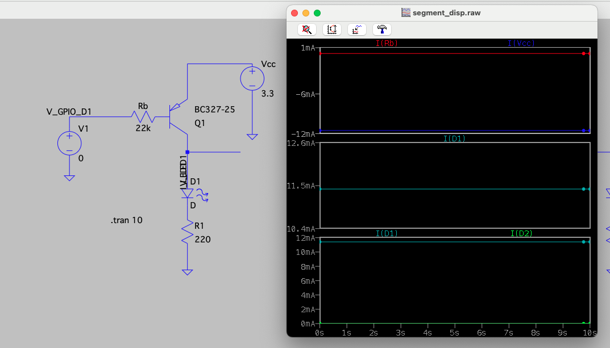
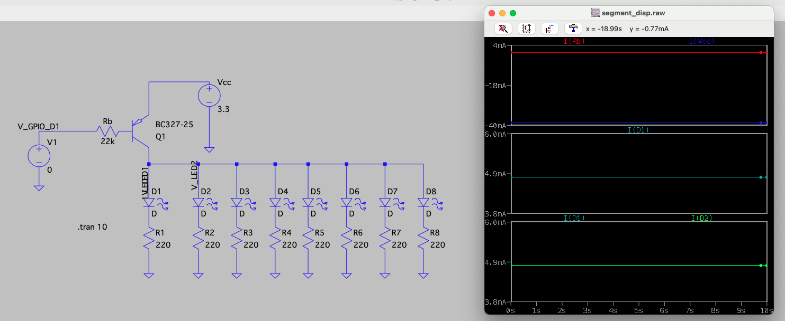
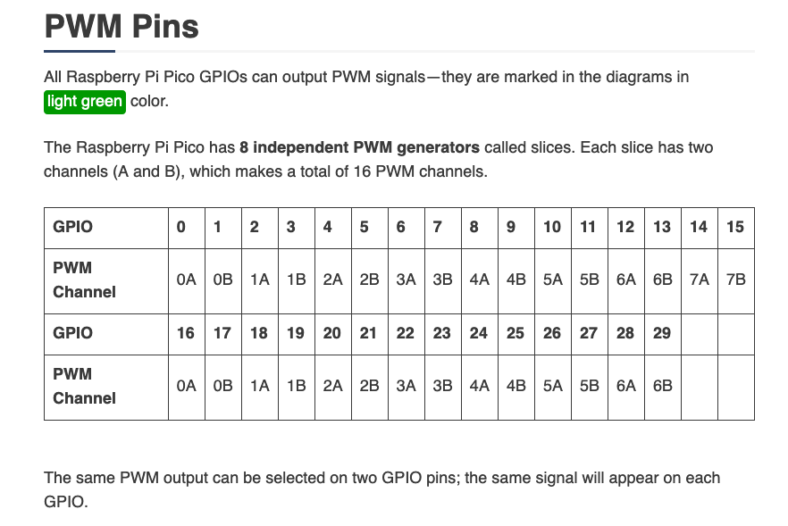
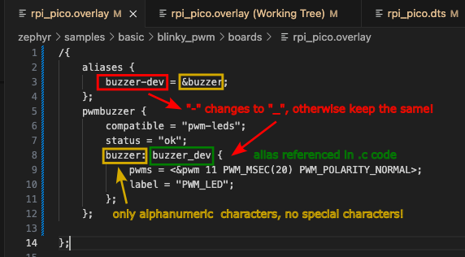

# Kitchen timer

Kitchen timer based on 4-digit 8-segment display 3461BS and RP Pico

## Electronics

The used display is a common anode display. The datasheet specifies 10 mA typical current for the optical characteristics of a segment. The GPIOs of RP Pico can provide 12 mA max. The built-in `3V3OUT` voltage regulator can output up to 300 mA, which is sufficient for all 8 segemts. Not the full 32 segments are needed since the digits are displayed with a given refresh rate sequentially once at a time. Simulation using LTSpice and PNP transistor `BCS327-25` leads to the choice of resistor values with 220 Ohm and 22k. For the edge cases "1 segment" and "8 segments" the current limitations are fulfilled.






## Zephyr RTOS

### Setting PWM on a pin

1.  Start by enabling PWM in the `prj.conf` file: `CONFIG_PWM=y`
2.  In the `.overlay` file, enable the node `pwm_led0` by setting the status:
    ```c
    &pwm_led0 {
	status = "okay";
    };
    ```
3. Check the PWM generator corresponding to the GPIO. For RP Pico, these are:
    

    It results in a table:
    |PWM channel Nr.|PWM channel| GPIO|
    |-|-|-|
    |0|0A|0|
    |1|0B|1|
    |2|1A|2|
    |..|..|..|
    |15|7B|15|
    |0 ❗|0A|16|
    |1|0B|17|

    This means that to set PWM ON GPIO 27, we will need `PWM 5B` with the number `11`.

4. In the `.dts` file (not the overlay!), edit the `pwm_leds` node:
   ```c
    pwm_leds {
		compatible = "pwm-leds";
		status = "disabled";
		pwm_led0: pwm_led_0 {
			pwms = <&pwm 11 PWM_MSEC(20) PWM_POLARITY_NORMAL>;
			label = "PWM_LED";
		};
	};
   ```
5. Next, set the PWM on the specific pin. In the `rpi_pico-common.dtsi`:
   ```c
    &pwm {
	pinctrl-0 = <&pwm_ch5b_default>;
	pinctrl-names = "default";
    };
   ```
6. Finally, add the pinmux in `rpi_pico-pinctrl.dtsi` for GPIO 27:
   ```c
   pwm_ch5b_default: pwm_ch5b_default {
		group1 {
			pinmux = <PWM_5B_P27>;
		};
	};
   ```
7. Follow the examples such as [PWM Blinky](https://docs.zephyrproject.org/latest/samples/basic/blinky_pwm/README.html#pwm-blinky) and compile them with the changed devicetree. If it works, start coding your own application.

## Device tree definitions

Device tree nodes are aliased like in the picture below. The change from `-` to `_` is mandatory!



In the `.c` code, the alias is used like:

```c
static const struct pwm_dt_spec my_variable = PWM_DT_SPEC_GET(DT_ALIAS(buzzer_dev));
```
 
## Links

- 
- https://www.electronics-tutorials.ws/blog/7-segment-display-tutorial.html
- https://www.instructables.com/12-Pin-7-Segment-Display-Wiring-Tutorial/
- https://www.reddit.com/r/AskElectronics/comments/oti47u/what_is_the_purpose_of_the_transistors_when_using/
- https://www.youtube.com/watch?v=sKJuzInKj_M
- https://www.youtube.com/watch?v=256VQ6eVNng
- https://www.youtube.com/watch?v=Fa7BHbPAM98

- Switch debouncing https://zephyrproject.org/how-to-debounce-button-inputs-in-a-rtos/
- PWM https://blog.golioth.io/adding-pwm-sound-in-zephyr/
